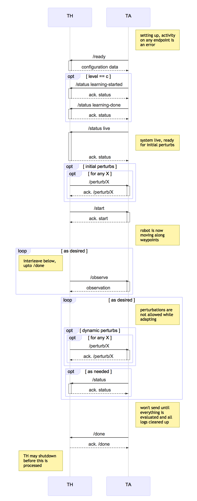

# CMU MARS (Aldrich), CP1: Integrated power model discovery and adaptation

## Overview

This challenge problem will demonstrate major advances in our capability to
machine learn power models efficiently under budget constraints to adapt to
perturbations such as environmental changes or changes in the internal
resources (Battery).


Modern software-intensive systems are typically composed of components that
are likely to change their behavior over time. For software to continue to
operate under such changes, the assumptions about parts of the system made
at design time may not hold at runtime after some point. Therefore,
mechanisms must be put in place that can dynamically learn new models of
these assumptions and use them to make decisions about missions,
configurations, and in general, how to adapt the software systems at
runtime for more optimal performance. The use of power in robotics systems
is one of the characteristics of cyber-physical systems that

  1. is rarely used to reason about mission completion, but is typically
     critical for a mission's success,
  2. will change over time due to chemical and physical characteristics of
     batteries as they degrade and are replaced over time, and
  3. will change as sensors/algorithms/workloads evolve over the lifetime
     of the system.

Using power as an example model, the aim of this challenge problem is to

  1. apply machine learning techniques to discover new power models for a
     robotics system, and
  2. take advantage of these new models at run time to improve the quality
     of missions of the robot over the use of no or static models.

In this phase, we will restrict the problem to one where we learn the power
model _off-line_ given a _limited learning budget_, but apply it on-line
for planning the mission (i.e., we will not consider dynamically changing
power models). Lincoln Labs will select models (from a predetermined set of
possible models) for different energy consumption profiles of hardware and
software components used by the robot (these models may not be faithful to
existing profiles, but may reflect future hardware and software energy
consumption characteristics). As a proxy for running physical experiments
to determine the power model, the MARS DAS will learn the model by querying
it within a predetermined number of times (note the learning budget is
specified by Lincoln Labs). This learned power model is then used during
robotic missions to improve the quality (and better satisfy the intents) of
the mission.


### Exploring the Research Questions through the Test

Mobile robotic systems are expected to perform a wide variety of long
range, long term and complex missions, inherently with different
characteristics. By contrast to industrial robotics where energy can be
supposed to be infinite, the management of autonomous mobile robot missions
requires to be able predicting the energy consumption of the robot with an
acceptable accuracy. Moreover, the mission complexity and the environment
versatility imposes to be able managing the embedded energy according to
different robot configurations (sensors, actuators, computation intensive
control algorithms, etc.), making the energy management a central issue for
autonomous robotic missions.

The goal of this challenge problem is to discover the power model of the
mobile robotics platform and use the discovered model to adapt for optimal
mission performance. The intent of this challenge problem is to simulate
robots with different hardware, algorithms, and workload and therefore
different power usage characteristics, in which we also intentionally
simulate severe changes that might be caused by unanticipated and
yet-unknown future environment changes. This challenge problem tests
whether we can adapt our robotic platform successfully to such situations.

Lincoln Labs will select a secret power model which is a function of
robot's configuration (speed, Kinect sensors, localization) and outputs
energy consumption. That is, Lincoln Labs can provide drastic differences
for energy consumption of hardware and software components that may not
reflect current but possibly distant-future hardware and software. The MARS
DAS will be able to query the model by providing inputs and receiving back
the output from the power model. In addition, the power model is used
during the evaluation to compute the battery level during simulation.

The challenge problem will proceed in two phases. First, the DAS will use
the query mechanism to query the power consumption for certain inputs
(simulating the idea of running experiments in practice to measure power
consumption in specific configurations). The DAS will query only a small
number of inputs until a query budget (specified by Lincoln Labs) is
exhausted.  The DAS will use the information gleaned to learn an
approximation of the secret power model.

In the second phase, the robot will be asked to complete `n` tasks (part of
a mission) within a map. There are charging stations on the map. The
learned approximation of the power model is used by the adaptation logic,
but the actual battery levels during the evaluation are computed with the
secret power model provided by Lincoln Labs. In the baseline scenario, the
MARS team will use no energy model at all, but rely on reactive planning to
go to the charging station when it is needed. The robot would therefore not
make effective planning decisions about when to recharge. The evaluation is
based on observable differences in terms of (i) mission success/failures
(e.g., running out of energy) and (ii) completion time (e.g., recharging
more effectively with fewer disruptions to the mission).

### Research Questions

**RQ1**: How adaptations that reason using *models that have been learned
under budget constraint* improve the quality of missions (in terms of
evaluation criteria including timeliness, success rate) compared to
reactive adaptations?

+ We assume the learning is *under limited budget constraints*. Also, power
  models are assumed to be *polynomial models parameterized over robot's
  configuration options and their interactions*.
+ In some cases an accurate model might tell us that we can finish a
  mission without going to the charge station. As a result, we will finish
  the mission earlier (i.e., better in terms of timeliness). In other
  cases, a reactive (i.e., non-learning) planner would force the robot to
  the charging station, but instead we could finish the mission without
  going to the station.
+ We will explore corner cases that adaptation using a learned model can
  provide us benefit by saving time, saving energy, or both, and therefore
  getting a better score in total.
+ We would also explore how the learning budget affects the quality of the
  mission. For this we will do sensitivity analysis where we learn the
  power model under different budgets from extremely low (2 attempts, to
  determine power consumption in the minimal (no components on) and maximal
  (all components on) configurations) to a high budget (e.g., 1000
  attempts).

**RQ2**: How can learning generate better adaptation strategies that impact
the satisfaction of mission goals and qualities?

+ One limitation of using model checking for generating adaptations is that
  the number of potential states generated by adaptation strategies will
  explode.
+ In this challenge problem, we use learning to enable to prune ineffective
  adaptation strategies and extract effective ones. More specifically, we
  learn the power model and we use the model for finding the strategies
  that lie on the Pareto front.
+ We expect that if we learn more accurately, the Pareto-front strategies
  are more effective with respect to the inaccurate estimation of power
  consumptions.

### Novelty
The first research question focuses on the learning under budget
constraint. Active learning under a budget constrain is still an open
problem. The end goal is to acquire the most informative data to learn a
model with low generalization error.

The second research question focuses on integrating a parametric power
model with the planner. In BRASS MARS, we use model checking for
synthesizing the adaptation plans. Model checking provides guarantees that
are important for safety-critical systems. However, the possible states
that the model checkers will have to check lead to combinatorial explosion,
in part because of the high number of possible adaptations. We will explore
the possibility of limiting the number of adaptation strategies by
selecting the most effective ones that lie on the Pareto front with respect
to the mission goals (energy consumption and timeliness in this challenge).

## Test Data

There are pieces of information that will be defined before the execution
of a test for this challenge problem:
* The [map](https://github.com/cmu-mars/cp1_base/blob/master/cp1_base/maps/cp1_map.json), including way point locations and locations of charging
  stations.
* A set of [software components](https://github.com/cmu-mars/model-learner/blob/master/conf/conf.json) (configuration options) that can be used by the
  robot.
* A power model from a set of predefined [power models](https://github.com/cmu-mars/cp1_base/tree/master/cp1_base/power_models) that are inherently
  different from each other and they simulate different power consumptions
  of the robot.

This is not the full robot configuration, just the parts that are
necessarily visible to adapt during test.

We will provide a baseline power model that describes the power consumption
of the system depending on a number of configuration options for the
baseline `A, B` that uses reactive planning. The model is a linear model
over the inputs (including interactions).

Possible secondary perturbations that correspond to the robot's environment:
* Placement or removal of one or multiple obstacles once or multiple times.
* Setting the current battery charge to a new value.

## Test Parameters

The start location, target locations, initial battery, ..., are all defined
in the test harness response to
[ready](https://github.mit.edu/brass/cmu-robotics/blob/master/documents/swagger-yaml/cp1-th.md#post-ready).

## Test Procedure

See overview above. In particular, this challenge problem will require a
training phase, `Tr`, where the model, provided by Lincoln Labs, is
learned. This requires a budget (number of times the hidden function will
be queried) that will be given by LL. We learn the function once during the
`Tr` phase, and then use the learned model during the missions.

There are three test stages proposed for the evaluation of this challenge
problem. They are defined as follows:

   1. A (no perturbation, no discovery/adaptation, predefined power model):
      The robot use a threshold to determine when to go to a charging
      station. The simulator uses the default power model to discharge and
      charge.

   2. B (perturbation, no discovery/adaptation, predefined power model):
      The robot use a threshold to determine when to go to a charging
      station. The simulator uses a selected power model to discharge and
      charge. Also, obstacle placement and setting changes as environmental
      perturbations are considered.

   3. C (perturbation, adaptation, learned power model): The robot adapts
      to the environmental perturbations, the same perturbations as in
      stage B, using the learned power model.


### Adaptation space and power model selection

In this challenge problem, we have a (feature) model that describe
the space of adaptation (configuration options and their values).

```json
{
  "localization": [0, 1],
  "kinect": [0, 1],
  "thermometer": [0, 1],
  "barometer": [0, 1],
  "gps": [0, 1],
  "laser": [0, 1],
  "camera": [0, 1],
  "bumpers": [0, 1],
  "cliff": [0, 1],
  "proximity": [0, 1],
  "sound": [0, 1],
  "light": [0, 1],
  "magnetic": [0, 1],
  "radio": [0, 1],
  "altitude": [0, 1],
  "speaker": [0, 1],
  "voltmeter": [0, 1],
  "lidar": [0, 1],
  "carbon-monoxide": [0, 1],
  "carbon-dioxide": [0, 1]
}

```

Note that we abstracted different aspects of the robot that are known to be
the main source of power consumption in robots, i.e., robot's motion
actuator, sensors, and computationally intensive algorithms in the
robot. These variations will be implemented by adjusting measurement
frequencies, spatial resolution, or depth resolution of the
sensors as an example.

An example configuration of the robot is encoded by 20 Boolean
variables:

```json
{ "config_id": 1,
  "configuration":
  {
    "localization": 1,
    "kinect": 1,
    "thermometer": 1,
    "barometer": 1,
    "gps": 1,
    "laser": 1,
    "camera": 1,
    "bumpers": 1,
    "cliff": 1,
    "proximity": 1,
    "sound": 1,
    "light": 1,
    "magnetic": 1,
    "radio": 1,
    "altitude": 1,
    "speaker": 1,
    "voltmeter": 1,
    "lidar": 1,
    "carbon-monoxide": 1,
    "carbon-dioxide": 1
  },
  "power_load": 60,
  "speed": 0.4
}
```

The total number of possible configuration for the robot is: `2^20 = 1M`, which makes a huge configuration space and will make the learning a challenging task.

The power consumption model is then specified as:

```
$P(.) = β_0 + β_o1*o1 + ... + β_o20*o20 + β_o12*o1*o2 + ... + β_o2019*o20*o19
```

where `o_i` are boolean variables, the coefficients for the variables
($β_i$) are any positive real numbers and the coefficients for the
interaction terms ($β_{oij}$) are any real numbers including negative or
zero.

The interaction terms in the power consumption model are important. Let us
give an example for the necessity of capturing interactions in the power
model: If the robot is configured with a Kinect with higher accuracy, the
localization and other parts of the robots might need more computational
power to process the pixels, basically there is more information to
process, therefore, these two variables (i.e., Kinect and Localization)
might interact. This means that the consumption of the robot is bigger than
the consumptions of each of the Kinect and Localization individually.

In this challenge problem, discharge of the robot is
controlled, not by law of the physics for battery but as an arbitrary
function that looks similar to power model that exist in the literature but
with different coefficients that meant to simulate discharge and charge
functions for possible future sensory, computational, or actuating
components of the robot.

#### Battery dynamics

The battery will be discharged according to open-circuit battery model that
we implemented in
[brass_gazebo_battery](https://github.com/cmu-mars/brass_gazebo_battery). This
power model simulates the power consumption of a robot. The amount of power
consumed by each component of a robot depends on its usage. Given a period
of time `dt` during which the configuration of the robot remains unchanged,
the charge level of the battery at the end of the period is calculated by
adding the charge delta and subtracting the discharge delta from the
battery level at the beginning of the time period. The battery level cannot
go below 0 at any moment.

* *Discharge*: `$discharge_δ(t) = P_discharge(.)*dt$`
* *Total change*: `$new_battery_charge(t, old_battery_charge) = max(0, old_battery_charge - discharge_δ(t))$`


## Interface to the Test Harness (API)

### REST Interface to the TH

The Swagger file describing this interface is
[swagger-yaml/cp1-th.yaml](swagger-yaml/cp1-th.yaml) which should be
considered the canonical definition of the
API. [swagger-yaml/cp1-th.md](swagger-yaml/cp1-th.md) is produced
automatically from the Swagger definition for convenience.

This API is currently still a draft. Some, but not all, possible future
changes include:
 * adding more constants to the enumerated error codes in the TH `/error`
   end point
 * adding more constants to the enumerated status codes in the TH `/status`
   end point


### REST Interface to the TA

The Swagger file describing this interface is
[swagger-yaml/cp1-ta.yaml](swagger-yaml/cp1-ta.yaml) which should be
considered the canonical definition of the
API. [swagger-yaml/cp1-ta.md](swagger-yaml/cp1-ta.md) is produced
automatically from the Swagger definition for convenience.

This API is currently still a draft. Some, but not all, possible future
changes include:
 * adding more constants to the enumerated error codes in the `400` returns
   from different end points.

### Sequence Diagram for Interaction Pattern

Implicitly, the TA can hit the `/error` endpoint on the TH at any time in
this sequence. This interaction is omitted for clarity.




## Intent Specification and Evaluation Metrics
In this challenge problem, we evaluate how adaptations made by a planner
that uses a learned model partially restore intent (e.g., switching to an
alternative Kinect, less accurate navigation algorithm). We measure quality
as an approximate measure of how closely the behavior of a system meets its
intent.

### Intent Specification

The ultimate goal of CP1 is to demonstrate that the adaptation (analysis +
planning) with an accurate model that we learn is better than the case with
no learning, i.e, using an inaccurate model. In CP1, we consider two types
of intents at two different levels (i.e., one is primary criterion and the
other is secondary): (i) Success rate (number of targets reached), and (ii)
Timeliness (time to completion).


#### Intent Element 1: Success rate
**Informal Description**: Percentage of tasks in which the robot gets to
the target location.

**Test/Capture Method**: For determining whether a task is accomplished
successfully, the position of the robot will be read from the
simulator. This will be returned in the `/done/tasks-finished` data structure.

**Result expression**: `location{i} = (/done/tasks-finished{i}/x, /done/tasks-finished{i}/y)` for each task `i` completed.
`total_tasks=size(/ready/target-locs)`

**Verdict Expression**: Using the information in `/done` message by
calculating the proportion of the number of tasks that have successfully
been finished (`/done/tasks-finished`) comparing to the original list of
tasks in `/ready/target-locs` message to calculate the following evaluation
function for the number of tasks completed. Note that every time robot
accomplishes a task it send an `at-waypoint` status message to TH. We
consider a task accomplished, if it gets within `MAX_DISTANCE` of the
target. Also, `/ready/target-locs` is an ordered list of locations: each
task will be accomplished in order specified in the list and if for
accomplishing a specific task other way-points are encountered, we do not
consider their associated tasks as accomplished. Therefore,
`/done/tasks-finished` will be the tasks finished in the same order as
`/ready/target-locs`.


```
function distance(loc1, loc2) = sqrt((loc1.x - loc2.x)^2 + (loc1.y - loc2.y)^2))
```

For each task `t` in `/done/tasks-finished`:

`target = map_location(t{name})`

`location = (t{x}, t{y})`

`score = `

| Condition                                                        | Score                                             |
|------------------------------------------------------------------|---------------------------------------------------|
| distance(location,target) < MAX_DISTANCE 	                       | 1                                                 |
| else                                                             | 0                                                 |

`r = sum(score) / total_tasks`

Note that the ordered list of tasks that are reported to be finished by the bot and can be retrieved in `/done/tasks-finished` should be a subset of the tasks in the ordered set tasks in `/ready/target-locs`, otherwise the final score is zero, `r=0`. I.e., in the code below if `is_valid_case(/done/tasks-finished/name, /target-locs)==False` then `r=0`.

```python
>>> def is_valid_case(A,B):
      B_iter = iter(B)
      return all(a in B_iter for a in A)

```


**Challenge Evaluation**: `PASS` if `r_c == r_a`, `DEGRADED` if `r_b <= r_c
< r_a`, `FAIL` if `r_c < r_b`.  In the `DEGRADED` case, the score is
proportional to the number of tasks that have been accomplished in baseline
A: `r_c / r_a`.

#### Intent Element 2: Timeliness
**Informal Description**: The total time that all tasks completed in both
stage B and stage C. Note that this is a secondary criteria and we evaluate
it as far as we can retain information for baseline B.

**Test/Capture Method**: The `/done` message will contain the simulation
times when the robot reached the end of each task that it completed.

**Result expression**: `t_x(i) = /done/tasks-finished[i]{sim-time}` where
`sim-time` is the total amount of simulation time needed to complete `i` in
test stage `x`. `lt_B = size(/done/tasks-finished)` in B, `lt_C =
size(/done/tasks-finished)` in C, and `lt = min(lt_B, lt_C)`.

**Verdict Expression**: Using the total time that the robot in baseline B
has finished the successful tasks. Note that every time robot accomplishes
a task it send an `at-waypoint` status message to TH so we will have the
status containing the location and timing associated for the last
accomplished task even through it may fail to accomplish all the
tasks. Therefore, we can retain the time that robot accomplishes the
associated tasks in all baselines (`$T_x = \sum_{task=1}^{lt} t_x(task)$,
where $x = {b, c}$`). For example, `T_b` is the total time spent to
accomplish all tasks that were completed up to `lt` in test stage B
(baseline B).

**Challenge Evaluation**: `PASS` if `$T_b >= T_c$`, `DEGRADED` if `$T_b <
T_c <= 2*T_b$`, `FAIL` if `$T_c > 2*T_b$`. In the `DEGRADED` case, the
score is: `$T_c / 2*T_b$`.


We assume the following test stages for evaluation:
- A (no perturbation, no adaptation, predefined power model, reactive
  planning)
- B (perturbation, no adaptation, predefined power model, reactive
  planning)
- C (perturbation, adaptation, a PM will be selected by LL and planner uses
  a learned PM): the challenge with a combination of model-based planning
  with learned model.

|             |   (p:✕,a:✕) |   (p:✔,a:✕) | (p:✔,a:✔)   |
|-------------|-------------|-------------|-------------|
| Predefined  | `✔` (A)     |             |             |
| Predefined  |             | `✔` (B)     |             |
| Learned     |             |             | `✔` (C)     |

## Test Environment Resources

For testing, we require an Amazon EC2 `c5d.2xlarge` instance or larger instances. 

## Test Design

[Guideline](test-design-cp1.md)

## Static data

[Static data](../static-data/cp1/README.md)

### Backend components

Here is a list of [backend components](https://github.com/search?q=topic%3Acp1+org%3Acmu-mars+fork%3Atrue) for `CP1`.
