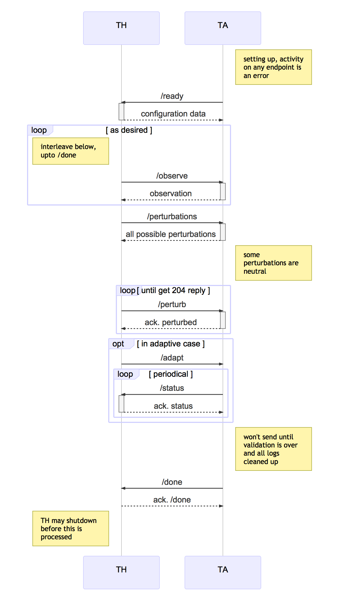

# CMU MARS (Aldrich), CP2: Code-Level Adaptation

## Overview

In this document, we outline a challenge problem that requires code-level
adaptation in response to source-code perturbations, representative of commonly
encountered robotics bugs.
Our challenge problem aims to simulate bugs that are exposed (or introduced)
during the natural evolution of robotics systems. For example, the system may
be modified to use a new computer vision system following the recent
discontinuation of Microsoft's Kinect camera, or a new feature may be
introduced (e.g., searching the environment for a particular object or QR code).
In such cases, (possibly latent) flaws in the implementation of the system may
manifest in test suite failure.
To simulate such bugs, we use a custom mutation injection tool, Shuriken,
designed to create bugs that are similar to those that frequently occur in
robotics systems.

We propose that the ability of the MARS system to adapt at the code-level be
evaluated by subjecting it to realistic faults (referred to as
*perturbation scenarios*) and measuring the degree to which intent
(represented by a fixed set of system-level tests) is recovered.

### Approach

To tackle this challenge problem, we plan to construct a search-based program
repair technique, designed to efficiently fix common robotics bugs rather than
attempting to address all theoretically possible bugs.
We plan to construct this technique by bringing together several of our
innovations in the fields of fault detection, localisation and repair,
including but not limited to:

* The use of *targeted repair* operators and better *fix prediction* to
  concentrate the allocation of limited resources on likely bug fixes.
* *Automated (system-level) test generation* for improving fault localisation
  accuracy and reducing the cost of testing.
* The use of an *online mutation analysis*, using the test results of candidate
  patches, to learn the shape and location over the course of the search.
* Elastic, *distributed repair* using commodity cloud-compute services, such as
  Amazon EC2, Microsoft Azure, and Google Compute Engine.

### Research Questions

This challenge problem is designed to answer the following research questions:

* **RQ1:** How often does search-based program repair successfully localise the
    perturbation to a single file?
* **RQ2:** How often does search-based program repair discover a partial repair?
* **RQ3:** How often does search-based program repair discover a complete repair?

## Testing Procedure

In this section, we discuss the procedure for testing our proposed solution.


A high-level overview of the testing procedure for this challenge problem is
illustrated above. Below we briefly discuss each of the stages involved in this
procedure.

1. **Generation:** A partial description of the perturbation scenario, provided
    by the examiner to the test harness, is forwarded onto the perturbation
    engine. The perturbation engine generates and returns a set of suitable
    code-level perturbations to the examiner, all of which satisify the
    specified characteristics.

2. **Injection:** The examiner selects a suitable perturbation from the set of
    suitable perturbations, and instructs the perturbation engine to inject
    the perturbation into the system.

3. **Validation:** The perturbed system is evaluated against the test suite to
    ensure that its behaviour is sufficiently degraded for at least one test
    (i.e., it must produce at least one `FAILED` test outcome).
    If the perturbation does not produce a change in the outcomes of the
    test suite, the perturbation is discarded and the examiner is required to
    inject an alternative perturbation.
    (More details on “intent” and our evaluation metric can be found at a later
    section in this document).

4. **Adaptation:** Once a suitable perturbation has been injected, code-level
    adaptation is triggered. The code adaptation engine will attempt to find
    a code-level transformation that (partially) restores intent, within a set
    of specified resource limits. 

5. **Summary:** Once the adaptation process has discovered a suitable
    transformation or has exhausted its available resources, a summary of the
    repair trial is communicated to the test harness. 

### Scenario Generation

Perturbation scenarios are encoded as an individual code-level mutation,
intended to represent a realistic fault (in the context of a robotics system).
Each constituent fault is generated using our (soon-to-be-)open-source
mutation testing tool, Boggart.

However, generating realistic faults remains an open challenge for both
robotics, and software systems in general [Just et al., 2014].
Using off-the-shelf mutation testing tools and operators can lead to
results that are not indicative of those that would be obtained by using
organic bugs [Pearson et al., 2017].

To counter this threat, we set out to better understand the nature of faults
in robotics systems. We conducted an empirical study of over 200 bugs in a
popular, open-source robotics system (ArduPilot). Based on our findings, we
crafted a set of bespoke mutation operators for Shuriken, designed to
replicate several of the most frequently encountered kinds of bugs.

1.  Remove void-function call (i.e., a function that returns void).
2.  Flip arithmetic operator (i.e., flip addition and subtraction, and
    multiplication and division).
3.  Flip boolean logic operator (i.e., flip `||` and `&&`).
4.  Flip relational operator.
5.  Undo transformation.
6.  Remove conditional control-flow statement.
7.  Replace (un)signed numeric type used by a given variable with the
    (un)signed equivalent of that type.

Note that all of the proposed mutation operators delete existing code -- no
operators inject new, faulty code. The reasoning behind this decision is
two-fold: Firstly, it produces a (single-edit) perturbation space that scales
linearly with the number of lines in the program, rather than polynomially.
Secondly, it excludes bug fixes that simply delete code, which are trivial
to find -- we keep the *truly challenging* bugs whose fixes require the
insertion of code.

## Interface to the Test Harness (API)

### Sequence Diagram for Interaction Pattern

Implicitly, the TA can hit the `/error` endpoint on the TH at any time in
this sequence. This interaction is omitted for clarity.



### REST Interface to the TH

The Swagger file describing this interface is
[swagger-yaml/cp2-th.yaml](swagger-yaml/cp2-th.yaml) which should be
considered the canonical definition of the
API. [swagger-yaml/cp2-th.md](swagger-yaml/cp2-th.md) is produced
automatically from the Swagger definition for convenience.

### REST Interface to the TA

The Swagger file describing this interface is
[swagger-yaml/cp2-ta.yaml](swagger-yaml/cp2-ta.yaml) which should be
considered the canonical definition of the
API. [swagger-yaml/cp2-ta.md](swagger-yaml/cp2-ta.md) is produced
automatically from the Swagger definition for convenience.

## Intent Specification and Evaluation Metrics

To evaluate candidate code-level transformations, we propose that a fixed suite
of tests, each describing a mission for the robot (e.g., to navigate a
simulated corridor), be performed in simulation.
Each test (or mission) within this suite is described by the following:

* a mission schema, describing a kind of mission. (e.g., navigate to a
  location.)
* a set of mission parameters, required to instantiate the mission schema
  as a concrete mission. (e.g., move from A to B.)
* a simulated environment. (e.g., a randomly generated maze.)
* a configuration for the robot. (e.g., a certain node may be disabled.)

Mission schemas are used to describe a certain type of mission
(e.g., point-to-point navigation) in terms of its
*parameters* (e.g., target location) and its expected *behaviours* (i.e., how
the mission is performed) and *outcomes* (i.e., the state of the robot
immediately after the execution of the mission).
Schemas are also responsible for classifying the outcome of a mission as either
*passing*, *failing*, or *degraded*, according to the degree to which the
robot behaves as expected by the schema.

Collectively, mission schemas are used to specify *intent* (i.e., the set of
intended behaviours of the robot in response to a mission). Test suites of
missions (i.e., instances of mission schemas) are used to approximately
measure whether intent is maintained by a particular version of the system.

### Mission Schemas

We propose that all missions within the test suite should belong to a
single mission schema, representing point-to-point navigation missions.
The parameters of each mission are used to specify the initial position
of the robot, and its target position.
The outcome of each mission will be classified as either `PASSING`, `FAILING`,
or `DEGRADED`, according to three internal elements intents, described
below.

1. **Accuracy:** The robot should come to rest at the target position.
    If the distance from the centre of the robot, `(l_x,l_y)`, to the
    target position, `(t_x, t_y)`, is less than or equal to the sum of the
    radius of the robot, `r`, and an expected error tolerance, `Δ_satisfied`,
    this intent is satisfied:

    ```
    dist((l_x, l_y), (t_x, t_y)) <= r + Δ_satisfied
    ```

    The intent is is said to be degraded if the position of the robot lies
    no further than `r + Δ_degraded` from the target position, where
    `Δ_degraded > Δ_satisfied`:

    ```
    r + Δ_satisfied <= dist((l_x, l_y), (t_x, t_y)) <= r + Δ_degraded
    ```

    This intent is violated if the resting position of the robot is further
    than `r + Δ_degraded` from the target position.

    ```
    dist((l_x, l_y), (t_x, t_y)) > r + Δ_degraded
    ```

2. **Timeliness:** The robot should come to rest within a certain period of
    simulator-clock time. This intent is satisfied if the time taken to
    reach a resting state, `t_rest`, is less than or equal to the sum of
    the expected duration of the mission, `t_expected`, and a tolerated
    lateness, `Δ_satisfied`:

    ```
    t_rest <= t_expected + Δ_satisfied
    ```

    If the time taken to reach a resting state exceeds the deadline for
    satisfying the intent, the intent may regarded as degraded by reaching
    a resting state before a second deadline:

    ```
    t_expected + Δ_satisfied <= t_rest <= t_expected + Δ_degraded
    
    where Δ_degraded > Δ_satisfied
    ```

3. **Safety:** The robot should not collide with any objects during the
      mission. This intent metric has no notion of being degraded -- collisions
      will result in the failure of the mission.

If any of these intents is violated, the outcome of the mission is labelled
as `FAILING`. If no intents are violated but at least one intent is
degraded, the outcome of the mission is labelled as `DEGRADED`. If all intents
are satisfied, the outcome is assigned a `PASSING` label.

### Comparison to Baseline

To measure the ability of our system to adapt to source-code perturbations, we
compare the test suite results of its *best* candidate adaptation (i.e., patch)
against those obtained by the unadapted, perturbed source code.
According to the BRASS terminology, we compare the following three versions
of the MARS system:

* **A:** Original source code (i.e., unperturbed case). Passes all tests.
* **B:** Mutated source code (i.e., perturbed case). Fails at least one test.
* **C:** Adapted source code (i.e., adaptive case).

The outcome of a perturbation scenario is evaluated according to the test suite
results of the three versions of the system:

* *complete repair*: if **(C)** passes all tests within the suite. (i.e.,
    **(C)** behaves identically to **(A)**, w.r.t. the test suite.)
* *partial repair*: if **(C)** pareto dominates **(B)**, but does not pass
    all of the tests.
* *no repair*: if **(C)** does not pareto dominate **(B)**.

More formally, we use a vector of ternary variables to describe the outcome of
the test suite for a particular baseline (or for any version of the program),
where the *i-th* component of that vector describes the outcome of the *i-th*
test in the suite. The totally ordered set of possible outcomes for individual
tests is given below.

```
type test_outcome := FAILED | DEGRADED | PASSED
  where FAILED < DEGRADED < PASSED
```

Below we describe an outcome for classifying the outcome of a perturbation
scenario (i.e., the success of our adaptive system). Let
`perturbed` and `adapted` be the vector of test suite outcomes for baselines
`B` and `C`, respectively.

```
def compute_scenario_outcome(perturbed, adapted):
  is_complete = True
  is_partial = False

  # compare results for each test case
  for (outcome_perturbed, outcome_adapted) in zip(perturbed, adapted):

    # to be considered a complete repair, C must pass all tests.
    is_complete &= outcome_adapted == PASSED

    # if C fails any tests that were passed by B, we label C as "no repair"
    if outcome_adapted < outcome_peturbed:
      return NO_REPAIR

    # if C performs better than B on this test, C is a partial repair, unless
    # it fails a (different) test that was passed by B
    if outcome_perturbed > outcome_adapted:
      is_partial = True

  # implies C = A (in terms of test outcomes)
  if is_complete:
    return COMPLETE_REPAIR

  # implies B < C < A (in terms of test outcomes)
  if is_partial:
    return PARTIAL_REPAIR

  # implies C = B (in terms of test outcomes)
  return NO_REPAIR
```

## References

[Just et al., 2014] Just, R., Jalali, D., Inozemtseva, L., Ernst, M. D.,
Holmes, R., and Fraser, G. (2014).
Are mutants a valid substitute for real faults in software testing?
In Proceedings of the 22nd ACM SIGSOFT International Symposium on Foundations of Software Engineering,
FSE '14. ACM.

[Pearson et al., 2017] Pearson, S., Campos, J., Just, R., Fraser, G., Abreu, R., Ernst,
M. D., Pang, D., and Keller, B. (2017). Evaluating and improving fault localization.
In Proceedings of the 2017 International Conference on Software Engineering, ICSE
’17. ACM.
