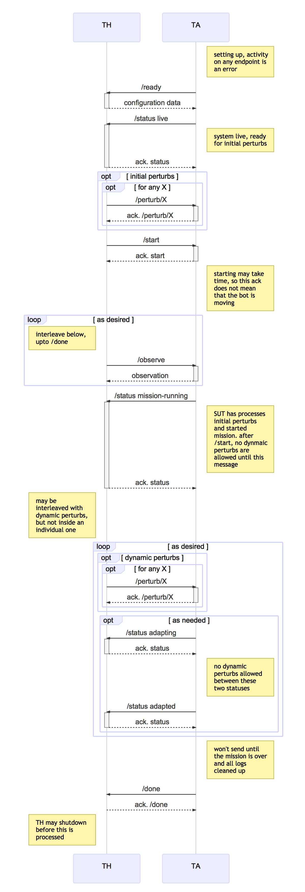
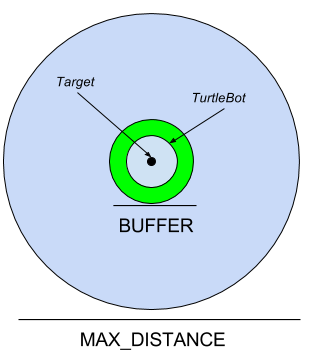

# CMU MARS (Aldrich), CP3: On-line robotic software architecture adaptation to software failure, unexpected environments

## Overview

This challenge problem will demonstrate major advances in our capability to adapt to perturbations such as software component failure or environmental change.

Today's self-adaptive systems are typically limited to selecting from pre-determined plans for adapting to specific responses. In BRASS--and for long-lived software in general--these adaptations will need to be discovered when the system is in operation, to enhance maintainability and software resilience over time.  We use relational and probabilistic multi-objective planning to consider a wide range of adaptations including:
 * software configuration
 * software component parameters
 * mission adaptations

Changing software configuration on-line is difficult because components must be taken down and others restarted in an orderly way.  Most past work does not consider adaptations based on software configuration; the little work that does is based on pre-determined adaptation plans, not online discovery.  Prior work also has not considered combination of software configuration adaptations with parameter adaptation and mission adaptation; this creates both modeling and scalability challenges.

### Research Questions being Addressed

- Can the optimal architectural structure of a system (with respect to the satisfaction of mission goals) be generated with multi-objective planning? Can we use this to manage change to the structure of the software on-line?
- How can we manage the interplay between constraints on structure, behavior, and quality when adapting software?
- Modern CPS are a combination of models; how can we represent global constraints over multiple models and use them to help guarantee correctness and quality of software change plans?
- To what extent can we predict the outcomes of adaptions and their impact on the satisfaction of mission goals and qualities?
- What proportion of techniques can be used on line vs. needs to be done off-line?

### Exploring the Research Questions through the Test

These research questions will be addressed on our robotics platform, where the robot must carry out a navigation mission while dealing with perturbations that will make it difficult to achieve the mission. The qualities of the mission will be related to battery charge, timeliness, and accuracy - the robot must get close to the location by a deadline (which the robot may change based on predictive models) and with some charge. The perturbations available to the test are designed to trigger software configuration changes that can be handled on-line (changes to actual source code are being addressed in CP2), as compared to Phase I CP1 where perturbations predominately triggered mission changes. The robot configurations that will be considered are:

- The use of various sensors: kinect depth, kinect image, planar LIDAR
- The availability of different navigation and localization subsystems: depth image based using either kinect (3d pointcloud) or lidar (planar depths), image marker based (using only RGB image with no depth)

The perturbations to the robot and environment that will trigger change are:

- Failure of sensors: kinect depth and LIDAR
- Turning on and off lights in the world
- Failing components (ROS nodes) in the robot itself

Mission quality will be assessed using a utility preference function. Lincoln Labs will be able to choose a preference function from among a set of three such functions (see below).

## Test Environment Resources

For testing, we require an Amazon EC2 `c5d.4xlarge` instance or equivalent. Or data gathering relied on this environment, and may cause inconsistencies on other platforms.

## Test Data

The following pieces of indormation will be defined pre-test for this challenge problem:

1. The map, including waypoint locations and locations of lights.
2. The set of sensors that the robot can use.
3. The set of software components (nodes) that can be used and perturbed in the test. (Note: this is not the full robot configuration, just the parts that are neccessarily visible to perturb during test.)
4. A set of valid starting configurations that can be used to set up the test.

The JSON format for these pieces of information are:

### Map

```
{"map" : [ {"node-id" : STRING, "coord" : { "x" : FLOAT, "y" : FLOAT}, "connected-to" : [ STRING, ...] }, ...],
 "lights" : [{"light-id" : STRING, "coord" : {"x" : FLOAT, "y" : FLOAT}, "status" : ONOFF]
}
```

Where,
- `node-id` is a string indicating the label for the waypoint (it will probably be of the form l1, l2, l3, but this should not be assumed).
- `coord` is composed of floats, significant to one decimal, indicating the coordinate of the waypoint, in meters from some origin point
- `connected-to` is the set of labels that a node is connected to, and should be drawn from the set of node-id's defined in the map
- `lights` are the ids and locations of each of the lights in the map (the coordinates being meters from the same origin as the waypoints). The light status of ONOFF = enum{ON,OFF} indicates that the light is on or off. If status is not there, assume that the light is on.

The set of all "node-ids" will be referred to as WAYPOINT_SET; the set of all light "light-ids" will be referred to as LIGHT_SET.

The map for this challenge problem can be tracked at:
https://github.com/cmu-mars/cp3_base/blob/master/cp3_base/maps/cp3.json . The precise version to use will be fixed at a later date -- currently this tracks the develop branch.

### Sensors

The robot will have three sensors that can be referred to by the test harness:

- `kinect`: Is the sensor that gives Kinect images depth
- `lidar`: Is the planar Hokuyo lidar sensor
- 'camera`: Is the dual camera that gives RGB images that can be used for visual navigation

```
SENSOR_SET = enum {kinect, lidar, camera}
```

### Nodes
The robot will have a set of software nodes that can be referred to by the test harness, these will be e.g.,

- `amcl`: The adaptive Monte Carlo localization algorithm that uses depth information and odometry to estimate robot location in a map
- `mrpt`: A particle based localization algorithm
- `aruco`: A visual marker based navigation subsystem

```
NODE_SET = enum {amcl,mrpt,aruco}
```

### Configurations
The robot will have a set of valid configurations that the test harness can start the robot up in. These will be given a label of the form `CONFIG<N>`.

```
CONFIG_SET = enum {amcl-kinect, amcl-lidar, mrpt-kinect, mrpt-lidar, aruco}
```

### Utilities
The adaptation engine will use one of a set of utility functions that can be specified for Lincoln Labs. The utility function may cause different adaptations to occur in the same context, depending on what trade-off is being made. The set of allowable functions are labeled as:

```
UTILITY_SET = enum {favor_timeliness, favor_safety, favor_efficiency}
```

## Test Parameters

The test will be able to be parameterized in a number of ways, and this will be done via the response to ready. The elements that may be specified for the test are:

- the initial robot position, as well as the target location for the robot, which constitutes the mission. Both of these will be specified using waypoint labels defined in the map. It is intended that the start and target waypoint **NOT** be the same label.
- the initial configuration of the robot, chosen from a set of potential robot configurations. This will be one chosen from a set of labels that specify the configuration, that are part of the test data, i.e., `CONFIG_SET`
- whether adaptation is enabled for this test. A boolean.
- the utility preference function to use for trading off adaptations, one of the labels from `UTILITY_SET`

## Test Procedure

As in Phase 1, this challenge problem will have three cases A, B, and C, as described below.

- *Baseline A*: The robot will be given an initial configuration (software and sensor components), a starting location, and a target location, and will attempt to navigate using a predefined plan to the target location.
- *Baseline B*: This is the same as *Baseline A*, but the robot and environment can be perturbed in a number of ways
- *Challenge*: A DAS will run on top of *Baseline B* that can make changes to the robot software and sensor activation.

It is intended that there be a range of perturbation sets explored (e.g., not all perturbations should be made for each test). Furthermoe, some perturbations to make make sense in some contexts. For example, if the kinect or lidar are valid sensors, changing lighting conditions will not have an effect. (If the kinect fails, or if the initial configuration starts without the kinect active) then it lighting may come into play.

## Interface to the Test Harness (API)

### Sequence Diagram for Interaction Pattern

Implicitly, the TA can hit the `/error` endpoint on the TH at any time in
this sequence. This interaction is omitted for clarity.



### REST Interface to the TH

The API to the TH defines endpoints for the following REST APIs:

- /ready - indicates that the TA is ready and should be given configuration information for the test
- /error - indicates that the TA encountered an unrecoverable error, and the test case has failed
- /status - indicates various status messages as the test progresses
- /done - indicates that the test is done and the machine running the test can be shut down.

The Swagger file describing this interface in full is
[swagger-yaml/cp3-th.yaml](swagger-yaml/cp3-th.yaml) which should be
considered the canonical definition of the
API. [swagger-yaml/cp3-th.md](swagger-yaml/cp3-th.md) is produced
automatically from the Swagger definition for convenience.

### REST Interface to the TA

The API to the TA defines endpoints for the following REST APIs:

- /start - indicates that the robot should start its assigned mission
- /perturb/light - cause a light in the environment to be turned on or off
- /perturb/sensor - cause a sensor's state to change to on or off
- /perturb/nodefail - cause a component in the robot software to fail at run time
- /observe - returns the current state of the mission


The Swagger file describing this interface is
[swagger-yaml/cp3-ta.yaml](swagger-yaml/cp3-ta.yaml) which should be
considered the canonical definition of the
API. [swagger-yaml/cp3-ta.md](swagger-yaml/cp3-ta.md) is produced
automatically from the Swagger definition for convenience.


## Intent Specification and Evaluation Metrics

### Intent Element 1: Accuracy
**Informal Description**: Robot comes to the target location.

**Formal Description**: The intent here is that if we get close to the goal (within 50cm from the center of the robot), then we get 1. Otherwise we get a linearly decreasing score the further away we are. So, if the turtlebot finishes in the green area in the figure below we get a score of 1; in the blue area we get 0 > score > 1; outside the blue circle we get 0.


**Test/Capture Method**: The position of the robot will be read from the simulator. This will be returned in the `done` message which will contain `final_x` and `final_y` which will be the actual coordinates (in the simulator) of the robot.

**Result expression**: `location = (/done/final_x, /done/final_y)`

**Verdict Expression**:

| Constant | likely value | meaning |
|----------|--------------|---------|
| BUFFER   | 50cm | the radius of the robot, plus some buffer that robotic algorithms determine as close enough |
| MAX_DISTANCE | 3m |  The maximum distance from the buffer zone that can be considered near the target. |

```
function distance(loc1, loc2) = sqrt((loc1.x - loc2.x)^2 + (loc1.y - loc2.y)^2))
```


| Condition                                                        | Score                                             |
|------------------------------------------------------------------|---------------------------------------------------|
| distance(location,target) < BUFFER	                | 1                                                 |
| BUFFER < distance(location, target) < MAX_DISTANCE	 | 1-(distance(location,target)-BUFFER)/(MAX_DISTANCE+BUFFER) |
| else                                                             | 0                                                 |

**Challenge evaluation for degraded intents:**

C = the challenge (with adaptation on)\
B = base (with no adaptation)

DEG_C = the score (0..1) degraded of C\
DEG_B = the score (0..1) degraded of B

| **C ->,<br/> B \\/**  | **PASS**              | **DEGRADED**                             | **FAIL** |
|-------------|-------------------|--------------------------------------|------|
| **PASS**        | INCONCLUSIVE      | FAIL                                 | FAIL |
| **DEGRADED**    | PASS              | PASS if DEG_C > DEG_B<br/>INCONCLUSIVE if DEG_C == DEG_B<br/>FAIL otherwise | FAIL |
| **FAIL**        | PASS | PASS | INCONCLUSIVE |

### Intent Element 2: Utility
**Informal Description**: The DAS maintains a high level of utility for the mission

**Formal Description**: Software systems are designed to trade-off different goals. Over time, these trade-offs may adapt and the system must change the way it responds to match these new trade-offs. For the purposes of this challenge problem, we represent the trade-offs as a utility preference function, but limit the preference functions to one that favors timeliness, one that favors efficiency, and another that favors safety. Utility will be a value on the interval [0,1].

**Test/Capture Method**: The done message will contain the final utility of the system, based on combining the metrics from the qualities of timeliness, efficiency, and safety described below.

**Result expression**: `utility = /done/final-utility`

**Verdict Expression**: The value for the verdict expression will be the value of utility. In the roll-up of the test, the test succeeds if the utility of the Challenge is greater than the utility of Baseline B. The function to be used for making tradeoffs will be specified by the evaluators as one of three functions that can broadly be described as (a) favoring timing, (b) favoring safety, or (b) favoring efficiency. The function will be of the form `w_t x timing_score + w_s x safety_score + w_e * efficiency score`, where the utility will be normalized to be in the interval [0-1].

The following weights are to be used in the evaluation:

|**Utility**|**Time Weight**|**Safety Weight**|**Efficiency Weight**|
|-|-|-|-|
|favor-timeliness| w_t = 0.6 | w_s = 0.2 | w_e = 0.2 |
|favor-safety    | w_t = 0.2 | w_s = 0.6 | w_e = 0.2 |
|favor-efficiency| w_t = 0.2 | w_s = 0.2 | w_e = 0.6 |

| Condition | Score |
|-----------|-------|
| utility >= 0.75 | PASS |
| utility <= 0.25 | FAIL |
| otherwise       | DEGRADED|


**Challenge evaluation for degraded intents:**

C = the challenge (with adaptation on)
B = base (with no adaptation)

DEG_C = the score (0..1) degraded of C
DEG_B = the score (0..1) degraded of B

| **C ->,<br/> B \\/**  | **PASS**              | **DEGRADED**                             | **FAIL** |
|-------------|-------------------|--------------------------------------|------|
| **PASS**        | INCONCLUSIVE      | FAIL                                 | FAIL |
| **DEGRADED**    | PASS              | PASS if DEG_C > DEG_B<br/>INCONCLUSIVE if DEG_C == DEG_B<br/>FAIL otherwise | FAIL |
| **FAIL**        | PASS | PASS | INCONCLUSIVE |

**Utility Component 1: Timing**

**Informal Description**: Robot reaches target location close to how fast Baseline A does

**Formal Description**:

Scoring requirements:

1. Account for some inaccuracy (can’t be right on the time). Call this BUFFER
2. Being quicker is better

**Test/Capture Method**: The running time of the test will be calculated starting when the test begins to when the mission is complete.

**Result Expression**:
```
location=(/done/final_x,/done/final_y)
arrival=/done/final-sim-time

arrival_C = arrival for Challenge
arrival_A = arrival for Baseline A
```

**Verdict Expressions**:

```
BUFFER = 60s, the amount of time we can be slower than A and still get a score

function close_enough (loc1, loc2) = distance (loc1, loc2) <= MAX_DISTANCE

```

| Condition                                                      | Score                                                |
|---|---|
| arrival_A >= arrival_C | 	1 |
| arrival_A + BUFFER >= arrival_C | (Arrival_A + BUFFER - Arrival_C)/BUFFER |
| else | 0 |


**Utility Component 2: Efficiency**

**Informal Description**: Robot uses minimal resources.

**Formal Description**: The intent is related to power usage of the robot for the mission. Having more power left at the end of a mission means that the robot would be able to do more subsequent tasks. We will use a power model from CP1 for evaluating this. The score for this will be based on how much power was used. Assuming that the robot finishes the mission with some energy left in the battery, then each condition will (A,B,C) will receive a score. The one with the highest score wins.

**Test/Capture Method**: The done message will report the remaining charge in the battery for the end of the mission.

**Result Expression**: `final_charge = /done/final-charge`

**Verdict Expression**:

|Constant | Value | Meaning |
|---------|-------|---------|
|MAX_CHARGE | 180000 | The maximum mwh that the battery can hold |

| Condition                                                      | Score                                                |
|----------------------------------------------------------------|------------------------------------------------------|
| final_charge > 0                                               | (final_charge)/MAX_CHARGE               |
| otherwise                                                      | 0 |

**Utility Component 3: Safety**

**Informal Description**: Whether the robot collides with something in the environment.

**Formal Description**: The intent is related to the risk that the robot takes to complete the mission. Being riskier means, e.g., traveling through an unknown environment at a high speed to complete the mission on time. We will have protrusions in the environment that are of a height that will make them undetectable by at least one of the sensors. Transitions in the map will be annotated to assess their riskiness of traversal.

**Test/Capture Method**: The done message will report the number an array of times and speeds when the robot collided with something on the map.

**Result Expression**: `collisions = /done/collisions`

**Verdict Expression**:

|Constant | Value | Meaning |
|---------|-------|---------|
|SAFE_SPEED | .25m/s | The speed at which colliding with something becomes unsafe |

| Condition                                                      | Score                                                |
|----------------------------------------------------------------|------------------------------------------------------|
| forall speed in collisions . speed < SAFE_SPEED                                                      | 1 |
| otherwise | 0 |
