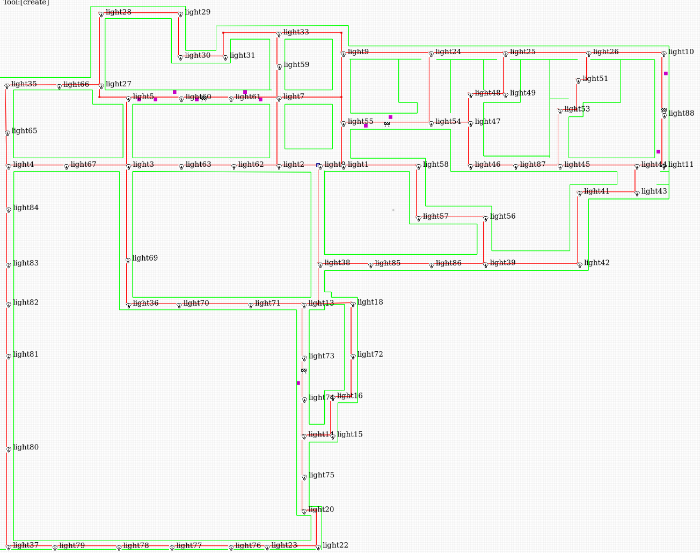

# Test Design (CP3)

Here we outline some of the heuristics for developing tests that may show interesting things for CP3. The reason for these heuristics are
that the state space of CP3 is quite large, and some of the perturbations have dependencies, that mean there is a potential for B to succeed
(and therefore the test rendered inconclusive) is quite large.

## Test Case Specification

The specification of tests is a tuple of the response to `ready` messages and the perturbations used in the test. The aim of the mission
is to traverse a map from a random starting position to a random target position, adpating sensor usage, software architecture configuration,
or path depending on the perturbations.

### Mission Parameters
- Start configuration: The valid software/sensor combinations that will result in usable robots are limited to five
configurations that Lincoln Labs may choose from: `{amcl-kinect, amcl-lidar, mrpt-kinect, mrpt-lidar, aruco-camera}`.
- Source/Target locations: The map defines a set of waypoints that represent intersections on the map. In this test, these waypoints range
from `l1 ... l59`, but due to a historical fact do not include `l20` or `l41`.
- Utility: The robot tries to maximize utility (goodness) of the results along three dimensions: time, safety, and efficiency. The test can
specify `favor-timeliness`, `favor-safety`, or `favor-efficiency`, and any adpaptations may be affected by this utility.
- Perturbations: The world can be perturbed in the following ways:
    - `nodefail`: A node can fail and no longer be used. Possible values: `amcl`, `mrpt`, `aruco`, which are different localization nodes that also require
    different architecture support
    - `sensor`: A sensor can be turned on or off. We interpret turning off a currently active sensor as that sensor failing. Possible values are `kinect`, `lidar`, `camera`.
    - `light`: Lincoln Labs can turn on an off lights, which may affect the performance of the aruco configuration.

  The status information of the test, reported to the TH when the mission starts or after it adapts, gives the current path that the robot is
  planning to traverse, the current configuration, and the currently active sensors.
- Evaluation metrics: We are evaluated on two dimensions: (1) Accuracy - does the robot reach (close to) the target? (2) With what utility
did the robot achieve the mission?

### Proper test case formation

There are a set of rules and heurstics start condition/perturbation combinations that should be considered in the design:

1. _Rule_: The start and target location must be different. We will throw an error if this is not the case, or if an illega waypoint is used.
2. _Heuristic_: Killing a node that is currently not in the configuration will have no effect, likely leading to B performing the same as A.
3. _Heuristic_: Similarly, failing a sensor that is not in the current configuration will have no effect
4. _Heuristic_: The `aruco-camera` configuration is the only configuration that is likely to be affected by turning on and off lights
5. _Heursitic_: Turning off one light is likely to have a minimal affect; instead, turning off all lights in a corridor will likely lead to failure
of the robot in `aruco-camera` mode.
6. _Heuristic_: Turning of lights that are not on the planned path will likely not have an affect.

### Interesting test cases

The map has a number of paths that can be taken from one target to another. In most cases, we would like to have:

1. A coverage of the set of waypoints -- ones that are close together and ones that are further apart.
2. Some of the pathways have been designed to have an affect on the utilities -- e.g., we start some corridors off with no lighting, and we place
obstacles in some paths that may affect safety. These corridors are hightlighted in the attached image of the map. Having test cases that exercise
the robot on paths that are likely to contain these corridors should have some interesting results.

This is the same map showing, for clarity, just the position of the lights
but not the pre-darkened corridors and other features as above

