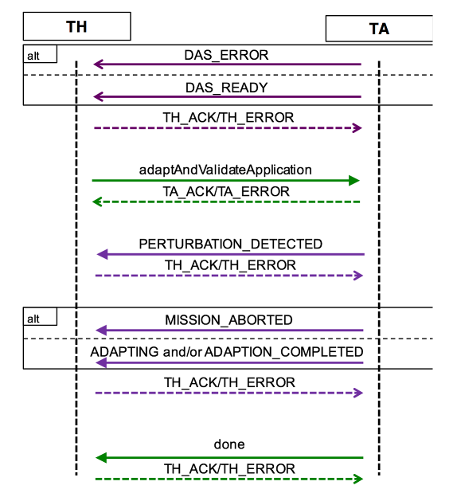

# Challenge Problem Template

## Overview

Provide a short description of the challenge problem, which describe the challenge problem scenario and the key mission goals and technology employed to support this challenge problem.

The following questions should be thought about and addressed somewhere in this document.

* Describe the mission scenario of where Autonomy (RASPBERRY-SI solution or any other solutions developed by the team involved in the ARROW/COLDTECH) and the System under Test (the OceanWATERS/OWLAT testbeds, we will call them SuT from now on).

* Please provide more detail about the Autonomy.

* What will this challenge problem focus on demonstrating?

* What are the key technologies/enablers for this challenge problem (e.g., online machine learning and assurance monitors will be present to allow the system to adapt to unforseen situastions).

* How would success be measured?

## Test Data

Describe any specific data that will be used or need to be generated to test the challenge problem. An example of this from our BRASS DARPA program where we were part of it. Specifically, one team, CRA, use of weather station data as a proxy for actual underwater vehicle sensor data.

If the challenge problem will not need any specific data sets to be present or generated we should provide a short note stating such.

## Test Parameters

Describe the different parameters (we called it knobs!) that will be explored in the evaluation. These parameters represent the input state-space of ecosystem changes presented to the system under test. We should be as specific as possible to the types and values for each parameter. The following table format can be used to describe the parameters of the system under test.

| Name           | Value                        | Description  |
| -------------- | ---------------------------- | ------------ |
| BatteryVoltage | Integer in `range(104, 165)` | Change the robot battery voltage – value can be changed prior to or during test runtime. |
| HasSensor      | Boolean                      | If True a new sensor is available for the vehicle to measure X aiding in its navigation. This value will be set prior to test. |

## Test Procedure

Describe how the Test Harness (We currently do this manually, but this can be partially or fully automated) will interact with the Challenge Problem (i.e., Autonomy) and SuT. It is expected that there will be more dynamic engagement at runtime between the test harness and SuT as the designs become more complex. This may include changes to the underlying ecosystem but also the ability of the test harness to monitor critical aspects of the system.

Explain if there is any deviation from the testing strategy (Baseline A, Baseline B, Challenge Stage). Describe what it means to test the challenge problem in each of those stages (i.e. Baseline A will choose settings for knobs A and C, B will always be set to its default value – Baseline B and the Challenge Stage use the same knob settings for A and C chosen in Baseline A. In addition, a new setting for knob B will be presented to Baseline B and Challenge Stage).

Baseline A – Description

Baseline B – Description

Challenge Stage – Description

We provide specific details and describe any testing strategies that should be followed. For example, you may want to define a number of test cases where a certain subset of the input state-space is explored while holding others constant.

## Interface to the Test Harness (API)

Based on the Test Procedure described above and what the API would look like to support the interaction between Autonomy and SuT testbeds. This should include parameters to initialize the system and those which will change at runtime through calls into the SuT.

The [CMU MARS team Phase 1 wiki page](https://wikis.mit.edu/confluence/display/BRASS/CMU+MARS+Phase+1+Challenge+Problem+Announcement) provides a good example of defining these calls (example table below).

```javascript
// Interface for test harness to observe the state of the robot
GET http://brass-ta/action/observe
TEST_ACTION:
  {"TIME" : TIME_ENCODING, "ARGUMENTS" : {}}
   ACTION_RESULT:
   {"TIME" : TIME_ENCODING,
    "RESULT" : {"x" : Float,
                "y" : Float,
                "w" : Float,
                "v" : Float,
                "voltage" : batteryLevel,
                "deadline" : Integer,
                "sim_time" : Integer
               }
   }
```

```javascript
// API to set up the initial conditions for the robot voltage level
POST http://brass-ta/action/set_battery
TEST_ACTION:
  {"TIME" : TIME_ENCODING,
  "ARGUMENTS" : {"voltage" : batteryLevel}
  }
ACTION_RESULT:
  {"TIME" : TIME_ENCODING,
  "RESULT" : {"sim_time" : Integer}
   }
```

An interaction diagram like the following would also be helpful in our discussions.



## Intent Specification and Evaluation Metrics

Describe if there is a new process for discovering/specifying intent of the challenge problem. How will the challenge problem allow us to measure intent preservation?

Example of intent specification: For some, it is a mission goal which needed to be satisfied (e.g. the samples from `n` number of points were collected – comparison with metris such as time to finish the sample collection, the energy consumption, the number of faults that were faced and resolved at runtime, the number of faults that could not be resolved, and any other metrics in the evaluation criteria in `Evaluation Criteria for Ocean World Lander Autonomy`). In other words, the evaluation results quantitatively compare how well the adaptive system performed relative to a non-adaptive baseline.

Describe each intent and what methods for evaluating them will be used. Specifically, we will use metrics defined by NASA JPL and Ames--`Evaluation Criteria for Ocean World Lander Autonomy` by `Mike Dalal, Hari Nayar, and the other members of OceanWATERS and OWLAT testbeds teams` that provides qualitative criteria by which to evaluate autonomy technologies developed for an autonomy system onboard an Ocean World lander, in particular as described in JPL’s 2016 Europa Lander Study, and as demonstrated on the NASA JPL OWLAT and NASA Ames OceanWATERS testbeds. We focus on criteria relevant to the modeling capabilities of either or both testbeds.