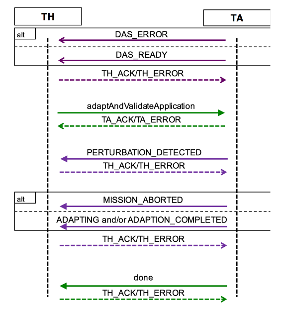

# Challenge Problem Template

## Overview

Provide a short description of the challenge problem, which describes the challenge problem scenario and the key mission goals and technology employed to support the challenge problem.

The following questions should be thought about and addressed somewhere in this document.

* Describe the mission scenario of  Autonomy (`RASPBERRY-SI` solution or any other solutions developed by the team involved in the `ARROW/COLDTECH` programs) and the `OceanWATERS/OWLAT testbeds` (we will use the target system interchangeably).

* Please provide more detail about the Autonomy.

* What will the challenge problem focus on demonstrating?

* What are the key technologies/enablers for the challenge problem (e.g., online machine learning and assurance monitors will be present to allow the system to adapt to unforeseen situations)?

* How would success be measured?

### Test Design

For specifying each test case, we use the following structure:

- Test Case #1: A name or sentence in English
- A `mission-specification` (`mission-spec.PLEXIL`)
- Intent Elements:
    - `intent-element-1`: A `intent-description` in English about the expected behavior from the target system and an `intent-formula` that determines the extent to which the target system maintained the expected behavior, by precisely measuring `deviations from the specified intent` (`intent-element-1-sympy-formula.txt`). 
    - `intent-element-2`: A `description` in English and a `formula` that determines the extent to which the target system is successfully maintaining intent as defined in the description of `intent-element-2` (`intent-element-2-sympy-formula.txt`). 
    - `intent-element-3`: A `description` in English and a `formula` that determines the extent to which the target system is successfully maintaining intent as defined in the description of `intent-element-1` (`intent-element-3-sympy-formula.txt`). 
- Test Data: `test-data`: [`data-items`]
- Test Configuration: `test-config`:[`any-other-test-level-configuration-options`]: Any information that may be required to run the test. For example, the time and the frequency of the faults injected into the target system. 

## Test Data

Describe any specific data that will be used or need to be generated to test the challenge problem. For example, we use the `owlat-sim` and collect data for our machine learning models, e.g., the causal model that we train and use in the plan generation at runtime.

If the challenge problem will not need any specific data sets to be present or generated we should provide a short note stating such.

## Test Configuration Parameters

Describe the different parameters (we called them knobs!) that will be explored in the evaluation. These parameters represent the input space of perturbations. We should be as specific as possible to the types and values for each parameter. The following table format can be used to describe the parameters of the system under test.

| Name           | Value                        | Description  |
| -------------- | ---------------------------- | ------------ |
| BatteryVoltage | Integer in `range(104, 165)` | Change the robot battery voltage – value can be changed prior to or during test runtime. |
| CameraCaliberated     | Boolean                      | True if the camera on the testbed can be perturbed by miscalibrating it at runtime. |


## Test Procedure

Describe how the Test Harness (We currently do this manually, but this can be partially or fully automated) will interact with the Autonomy and the Testbeds. It is expected that there will be more dynamic engagement at runtime between the test harness and Autonomy as the designs become more complex. This may include changes to the underlying target system but also the ability of the test harness to monitor critical aspects of the target system.

Explain the test stages (`Baseline A`, `Baseline B`, `Challenge Stage(s)`). Describe what it means to test the challenge problem in each of those stages: 

- Baseline A will choose settings for knobs A and C, and B will always be set to its default value.

- Baseline B and the Challenge Stage use the same knob settings for A and C chosen in Baseline A. 

- In addition, a new setting for knob B will be presented to Baseline B and Challenge Stage.

  * Baseline A – Description

  * Baseline B – Description

  * Challenge Stage(s) – Description

We provide specific details and describe any testing strategies that should be followed. For example, you may want to define several test cases where a certain subset of the input space is explored while holding others constant.

## Interface to the Test Harness (API)

Based on the Test Procedure described above and what the API would look like to support the interaction between Autonomy and Testbed. This should include parameters to initialize the system and those which will change at runtime through calls into the Testbed.


```javascript
// Interface for test harness to observe the state of the lander
GET http://ta/action/observe
TEST_ACTION:
  {"TIME" : TIME_ENCODING, "ARGUMENTS" : {}}
   ACTION_RESULT:
   {"TIME" : TIME_ENCODING,
    "RESULT" : {"x" : Float,
                "y" : Float,
                "z" : Float,
                "qw" : Float,
                "qx" : Float,
                "qy" : Float,
                "qz" : Float,
                "voltage" : batteryLevel,
                "deadline" : Integer,
                "sim_time" : Integer
               }
   }
```

```javascript
// API to set up the initial conditions for the lander voltage level
POST http://ta/action/set_battery
TEST_ACTION:
  {"TIME" : TIME_ENCODING,
  "ARGUMENTS" : {"voltage" : batteryLevel}
  }
ACTION_RESULT:
  {"TIME" : TIME_ENCODING,
  "RESULT" : {"sim_time" : Integer}
   }
```

An interaction diagram like the following would also be helpful in our discussions.



## Intent Specification and Evaluation Metrics

Describe the intents of the system in the challenge problem. How will the challenge problem allow us to measure intent preservation?

Example of intent specification: For some, it is a mission goal that needed to be satisfied (e.g. the samples from `n` number of points were collected – comparison with metrics such as time to finish the sample collection, the energy consumption, the number of faults that were faced and resolved at runtime, the number of faults that could not be resolved, and any other metrics in the [Autonomy evaluation criteria](./evaluation_criteria.md) as well as the task-level metrics defined by NASA [1]. In other words, the evaluation results quantitatively compare how well the adaptive system performed relative to a non-adaptive baseline.

Describe each intent and what methods for evaluating them will be used. Specifically, we will use metrics defined by the testbed provides at NASA JPL and Ames [1]. The defined task level metrics provide qualitative criteria by which to evaluate autonomy technologies developed for an autonomy system onboard an Ocean World lander, in particular as described in JPL’s 2016 Europa Lander Study, and as demonstrated on the NASA JPL OWLAT and NASA Ames OceanWATERS testbeds.

## References

[1] Mike Dalal, Hari Nayar, 'Evaluation Criteria for Ocean World Lander Autonomy,' (Oct 11, 2021).

[2] NASA JPL, Ocean World Lander Autonomy Testbed (OWLAT), 
[URL](https://www-robotics.jpl.nasa.gov/how-we-do-it/systems/ocean-world-lander-autonomy-testbed-owlat/) 

[3] NASA Ames, Ocean Worlds Autonomy Testbed for Exploration Research & Simulation (OceanWATERS), [URL](https://github.com/nasa/ow_simulator). 

[4] [RASPBERRY-SI project website](https://nasa-raspberry-si.github.io/raspberry-si/)