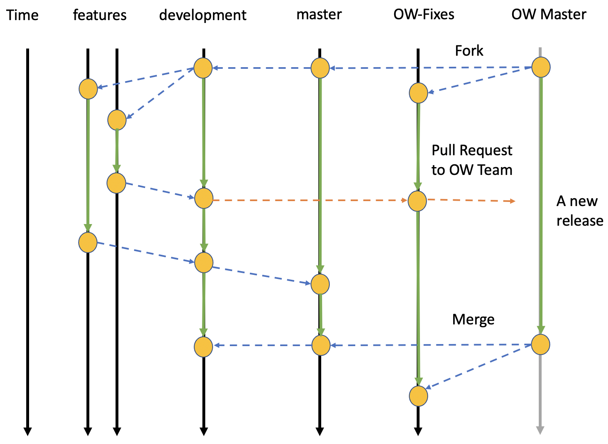

# Git Policies for RASPBERRY-SI

## Git branching policy

This document describes the Git process that the RASPBERRY-SI team follows for development, feature release, and integration testing with the testbeds.
Note that this repository is not intended to contain *all* RASPBERRY-SI code. Other code may exist in different repositories but will be merged into one repository for integration and testing with the testbeds (`OWLAT` and `OceanWATERS`).

There are three permanent branches:

1. **development**: This branch is for internal development and integration
   among different developers and researchers in RASPBERRY-SI. Teams can create feature branches off of this for working changes, new features, etc. For example, if a significant change is warranted, a new feature branch for the change should be created, wherein internal development can proceed. Once the developer is happy with the changes, it should be merged back into development, where it may go through a wider review among the team developing the module/component.

2. **integration-master**: This branch is for code/documentation that is intended for (a) internal review and (b) integration staging and testing before release to NASA. For example, if a developer wants to have a new feature reviewed by the PI, then they should merge from the `development` branch into the `integration-master` branch. The latest version in this branch will be the one required for review.

3. **master**: This branch is for code/documentation that is intended
   for integration staging and testing before release to the public. 

4. **ow-fixes**: This branch is rebased on the most recent release of 
   `ow_simulator` and is used for facilitating our contribution to the testbeds. If a bug is discovered in `ow_simulator` when working a feature
   branch, cherry-pick the fix into the `ow-fixes` branch and send a pull
   request. We also report the bug in the testbed repositories.

To summarize the intent, if a developer or team wishes to add a feature to
some part of the repository, they should do the following:

1. Create a branch from **development** that will contain the development of this new feature.

2. Merge into **development** for internal dev review and unit testing.

3. Merge into **integration-master** for internal integration testing. This branch should always build, and will likely be the branch that is used for CI.

4. Merge into **master** for release to NASA teams. 

We may prepend the development branch with the testbed name (`ow_simulator`, `owlat-sim`, `owlat-physical`) if it is related to a particular testbed.